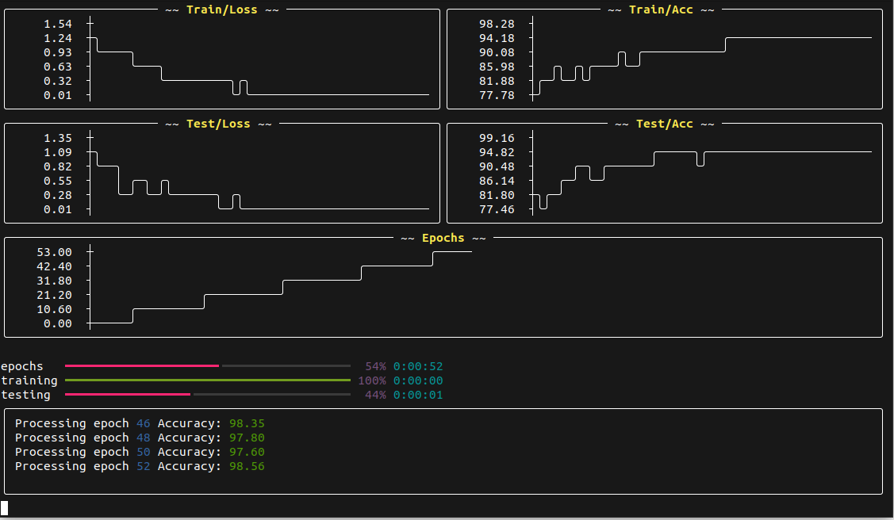

# GraphWriter

GraphWriter is a robust, interactive, and visually appealing wrapper for TensorBoard's SummaryWriter, designed to provide real-time insights into your machine learning model's performance right in your terminal. It uses the Rich library to render elegant visualizations, progress bars, and logs, thus turning your mundane terminal into a vibrant dashboard.



## Features

- Real-time scalar plots for training and testing metrics.
- Progress bars for iterable processes such as epochs and batches.
- Customizable console print function to log insights in a structured manner.
- Grouping of scalars based on prefixes for organized visualization.
- Colorful and lively terminal output, making the model training process more interactive and insightful.

## Installation

The project requires `torch`, `rich`, and `asciichartpy` libraries to be installed in your python environment.

```bash
pip install -r requirements.txt
```

## Usage

```python
from torch.utils.tensorboard import SummaryWriter
from GraphWriter import GraphWriter

# Initialize Tensorboard SummaryWriter
writer = SummaryWriter()

# Create an instance of GraphWriter
graph_writer = GraphWriter(writer)

# Simulate a training and testing process
for e in graph_writer.track(range(100), description="epochs"):
    for t in graph_writer.track(range(100), description="training"):
        # Simulated metrics
        train_loss = 3*math.exp(-0.1*e + 0.1*random.gauss(0, 1))
        train_acc =  100 - 20 * math.exp(-1.5*e/30) - random.randrange(0, 90)/(e+1)
        
        # Log metrics
        graph_writer.add_scalar('Train/Loss', train_loss, global_step=t + e*100)
        graph_writer.add_scalar('Train/Acc', train_acc, global_step=t + e*100)

    for t in graph_writer.track(range(100), description="testing"):
        # Simulated metrics
        test_loss = 2*math.exp(-0.1*e+ 0.2*random.gauss(0, 1))
        test_acc =  100 - 20 * math.exp(-2.0*e/30) - random.randrange(0, 90)/(e+1)
        
        # Log metrics
        graph_writer.add_scalar('Test/Loss', test_loss, global_step=t + e*100)
        graph_writer.add_scalar('Test/Acc', test_acc, global_step=t + e*100)
    
    graph_writer.add_scalar('Epochs', e, global_step=e)
```

The `GraphWriter` class is initialized with a `SummaryWriter` object, along with optional arguments for setting the maximum number of lines for print statements and progress bars. The `add_scalar` method is used to log scalar values to TensorBoard, and the `track` method is utilized to create progress bars for iterable processes.

## Methods

Here's a brief overview of the primary methods available in the `GraphWriter` class:

- `add_scalar(tag, scalar_value, global_step=None, display=True)`: Logs a scalar value to TensorBoard and updates the scalar panel.
- `print(*args, **kwargs)`: A custom print function to display text in the print layout.
- `track(iterable, description="Processing...")`: Yields items from an iterable and updates a progress bar.
- `update_scalars(tag)`: Updates the scalar panels with new data.
- `group_scalars_by_prefix()`: Groups scalar layouts by their prefix for organized visualization.

## Contributing

Contributions are welcome! Feel free to open an issue or submit a pull request.

## License

MIT

---

This README provides a comprehensive overview of the GraphWriter project, its features, installation steps, usage examples, available methods, and contribution guidelines.